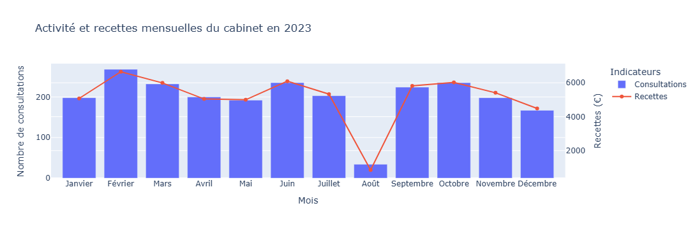
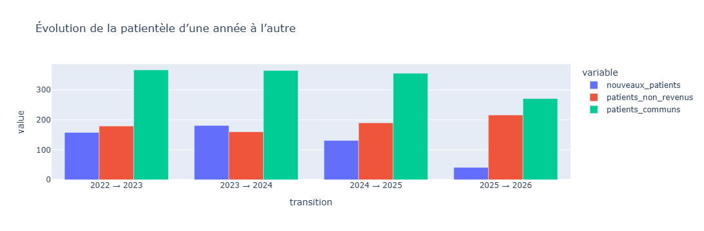

# Analyse d’activité d’un cabinet médical

Projet d’analyse de données réalisé dans le cadre d’une mission freelance visant à analyser l’activité, les recettes et la charge de travail d’un cabinet médical à partir de données opérationnelles réelles anonymisées.

---
## Aperçu visuel





---
## Aperçu du projet

Dans le cadre d’une mission freelance, un cabinet médical souhaitait mieux comprendre l’évolution de son activité sur plusieurs années, identifier les principales tendances économiques et obtenir des pistes concrètes d’optimisation organisationnelle.

Cette mission couvre l’ensemble du cycle d’un projet data :

- collecte et consolidation de données hétérogènes ;
- nettoyage et standardisation ;
- analyse exploratoire ;
- visualisation de données ;
- analyse métier ;
- recommandations opérationnelles ;
- production d’un livrable client.

---

## Objectifs

Les objectifs de cette mission étaient les suivants :

- consolider plusieurs exports Excel d’activité médicale ;
- nettoyer et harmoniser les données ;
- analyser l’évolution de l’activité du cabinet ;
- étudier la dynamique de la patientèle ;
- comprendre l’évolution des recettes ;
- estimer indirectement la charge de travail ;
- proposer des recommandations concrètes.

---

## Technologies utilisées

- **Python**
- **Pandas**
- **Plotly**
- **Jupyter Notebook**
- **CSV / Excel**
- **Markdown**
- **PDF reporting**

---

## Méthodologie

### 1. Préparation des données

Travail réalisé :

- consolidation de plusieurs fichiers Excel ;
- harmonisation des structures de données ;
- correction d’anomalies de saisie ;
- traitement des dates ;
- anonymisation des identifiants patients.

---

### 2. Analyse exploratoire

Étude des indicateurs globaux :

- nombre de consultations ;
- nombre de visites ;
- recettes ;
- estimation du nombre de patients distincts.

---

### 3. Analyse temporelle

Analyses multi-échelles :

- annuelle ;
- mensuelle ;
- journalière ;
- comparative interannuelle.

---

### 4. Analyse métier

Construction d’indicateurs spécifiques :

- nouveaux patients ;
- patients non revus ;
- fidélisation approximative ;
- revenu moyen estimé par consultation ;
- estimation indirecte de la charge de travail.

---

### 5. Restitution client

Livrables produits :

- notebook analytique détaillé ;
- rapport PDF synthétique orienté décision.

---

## Analyses réalisées

### Activité du cabinet

- volume annuel de consultations ;
- évolution des visites ;
- saisonnalité mensuelle ;
- activité moyenne par jour de semaine.

### Patientèle

- estimation du nombre de patients distincts ;
- renouvellement annuel ;
- fidélisation approximative ;
- dynamique interannuelle.

### Analyse économique

- évolution des recettes ;
- comparaison interannuelle ;
- estimation du tarif moyen implicite par consultation.

### Charge de travail

- estimation indirecte du temps moyen par consultation ;
- mise en perspective avec des standards observés ;
- identification de pistes d’optimisation.

---

## Résultats clés

Principaux enseignements :

- activité globalement stable sur plusieurs années ;
- patientèle fidèle avec renouvellement régulier ;
- saisonnalité marquée avec baisse estivale récurrente ;
- progression du revenu moyen par consultation ;
- charge de travail potentiellement élevée ;
- opportunités d’optimisation organisationnelle.

---

## Structure du dépôt

```text
├── notebooks/
│   ├── 01_preparation_donnees.ipynb
│   └── 02_analyse_cabinet_medical.ipynb
├── rapport/
│   └── rapport_synthetique.pdf
├── README.md
```

---

## Confidentialité

Les données originales du client ne sont pas publiées.

Le projet présenté ici repose sur une version anonymisée et expurgée des données, afin de préserver la confidentialité des informations sensibles.

---

## Valeur métier

Ce projet illustre ma capacité à :

- transformer des données brutes en analyses exploitables ;
- dialoguer avec un client métier ;
- produire des recommandations concrètes ;
- mener une mission data de bout en bout ;
- restituer des résultats de manière claire et structurée.

---

## Auteur

Projet réalisé dans le cadre d’une mission freelance indépendante.
